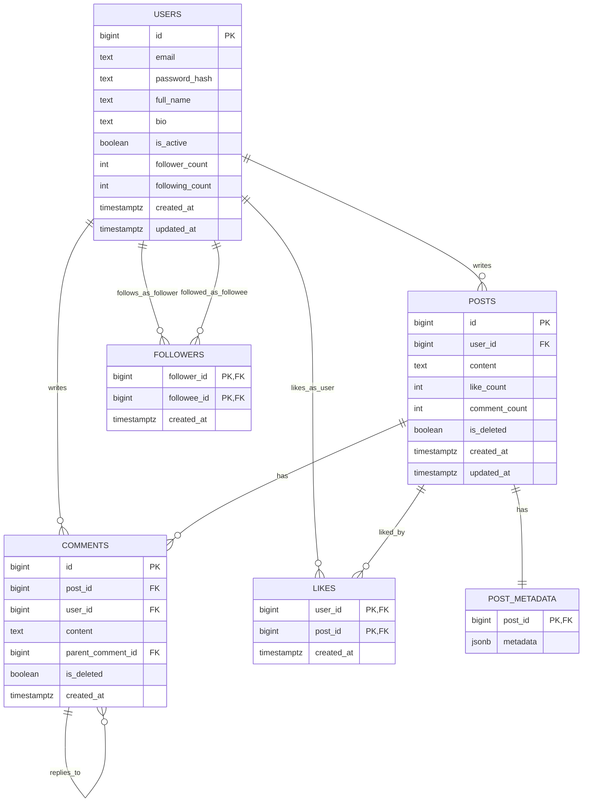

# Social Media Backend


A social media platform backend built with SOLID principles, deliberately
split across three databases by workload instead of forcing everything into
one store:

Demo video: https://vimeo.com/1216073326?share=copy&fl=sv&fe=ci

| Database | Role |
|---|---|
| **PostgreSQL** | Normalized (3NF) system of record — users, posts, comments, followers, likes — plus JSONB post metadata (tags/location) |
| **MongoDB** | Activity log — an append-only audit trail of likes/follows/comments/posts |
| **Redis** | Cached, rendered user timelines (60s TTL, invalidated on new posts) |

## Contents

- [Entity-Relationship Diagram](#entity-relationship-diagram)
- [Schema Explanation](#schema-explanation)
- [SQL Files](#sql-files)
- [Query Optimization Report](#query-optimization-report)
- [Architecture](#architecture)
- [Project Structure](#project-structure)
- [SOLID Applied](#solid-applied)
- [Getting Started](#getting-started)
- [Running with Docker](#running-with-docker)
- [Testing](#testing)
- [Documentation](#documentation)

## Entity-Relationship Diagram

The normalized PostgreSQL schema — `users`, `posts`, `comments`,
`followers`, `likes`, and the JSONB `post_metadata` side table. Full DDL
lives in [`sql/ddl.sql`](sql/ddl.sql) — the exact file the app loads on
startup.



`followers` and `likes` use composite primary keys — the relationship
*is* the key, so there's no surrogate `id` to maintain. `followers` also
carries a second composite B-tree index (`followee_id, follower_id`) to
serve "who follows me" lookups without a full scan.

## Schema Explanation

Every table is in third normal form — non-key columns depend on the whole
primary key and nothing else:

- **users** — every column (email, password hash, name, bio...) describes
  that one user and nothing else.
- **posts** — depends only on `posts.id`; `user_id` is a plain FK, not a
  transitive dependency (author details live in `users`, never duplicated
  onto a post).
- **comments** — same shape as posts, plus a self-referencing
  `parent_comment_id` for threaded replies.
- **followers** / **likes** — pure many-to-many association tables; the
  composite PK *is* the relationship, so there's nothing left to normalize.
- **post_metadata** — deliberately kept **out** of `posts` and stored as
  JSONB. Tags/location are optional and variable-shape; forcing them into
  fixed columns on `posts` would mean nullable columns for the common case
  of "no tags." This is a modeling choice for semi-structured data, not a
  3NF violation.

**Deliberate denormalization:** `users.follower_count`/`following_count`
and `posts.like_count`/`comment_count` are counts derivable from other
tables, cached for O(1) reads instead of `COUNT(*)` on every profile/post
view. They're updated by the same transaction that changes the underlying
rows — see the transactional follow write-up in
[`docs/database-design.md`](docs/database-design.md#transactional-follow) —
so they can't drift out of sync. Standard performance trade-off, not a
normalization mistake.

Full column-by-column detail lives in
[`docs/database-design.md`](docs/database-design.md#normalization-3nf).

## SQL Files

| File | Contents |
|---|---|
| [`sql/ddl.sql`](sql/ddl.sql) | The canonical schema — `CREATE TABLE`/`CREATE INDEX` for all six tables. Idempotent; this is the exact file `PostgresConnection` runs on every app startup. |
| [`sql/sample_data.sql`](sql/sample_data.sql) | A small, hand-built dataset (5 users, 8 posts, threaded comments, follows, likes, JSONB tags) for reviewing the schema by hand. |

Run them directly with `psql`, independent of the Python app:

```bash
psql -U postgres -d social_media -f sql/ddl.sql
psql -U postgres -d social_media -f sql/sample_data.sql
```

For a large synthetic dataset instead (to reproduce the optimization
numbers below), use [`scripts/seed_demo_data.py`](scripts/seed_demo_data.py)
— see [Getting Started](#getting-started).

## Query Optimization Report

Measured with `EXPLAIN ANALYZE` against a real, seeded database (500
users, 20,000 posts, ~7,900 follow edges) — not estimates. Full output in
[`docs/database-design.md`](docs/database-design.md#explain-analyze--measured-on-a-seeded-dataset).

| Query | Without index | With index | Result |
|---|---|---|---|
| "My posts" (`idx_posts_user_created`) | Seq Scan, 7.543 ms, 247 buffer hits | Index Scan, 0.294 ms, 25 buffer hits | **~26x faster** |
| "Who follows me" (`idx_followers_followee_follower`) | Would require a full scan | Index **Only** Scan, 0.013 ms, 0 heap fetches | never touches the heap |
| Trending (`idx_posts_feed`, partial index) | — | Bitmap Index Scan, 2.998 ms | recency filter never scans soft-deleted rows |

**A finding worth recording, not just the wins:** the multi-followee feed
query (30 followees, ~6% of all users) makes the planner choose a
**sequential scan** over the composite index — at that selectivity,
scanning the whole table once is cheaper than 30 separate index probes.
Composite indexes help the common single-author case dramatically; a large
`IN`/`ANY` fan-out is a different access pattern with its own break-even
point.

## Architecture

```
┌─────────────┐     ┌──────────────────┐     ┌─────────────┐
│   cli.py    │────▶│  composition.py  │────▶│  services/  │
│ (entry pt.) │     │ (DI wiring root) │     │ (business   │
└─────────────┘     └──────────────────┘     │   logic)    │
                                              └──────┬──────┘
                                                     │ depends only on
                                                     ▼ repository interfaces
                                          ┌────────────────────┐
                                          │  repositories/base  │
                                          │   (abstract ABCs)   │
                                          └──────────┬──────────┘
                              ┌──────────────────────┼──────────────────────┐
                              ▼                      ▼                      ▼
                    ┌───────────────────┐  ┌──────────────────┐  ┌──────────────────┐
                    │ postgres_repos.py │  │  mongo_repos.py   │  │ redis (cache      │
                    │  users, posts,    │  │  activity logs    │  │  client, injected │
                    │  comments,        │  │                   │  │  into PostService)│
                    │  followers, likes │  │                   │  │                   │
                    └─────────┬─────────┘  └─────────┬─────────┘  └─────────┬─────────┘
                              ▼                       ▼                      ▼
                        PostgreSQL                MongoDB                 Redis
```

Services never import `psycopg2`, `pymongo`, or `redis` directly — they
depend on the interfaces in `repositories/base.py`, and `composition.py` is
the only place concrete database clients get wired in.

## Project Structure

```
config/          Settings loaded from .env (frozen dataclass)
database/        PostgresConnection (pooled), MongoConnection
cache/           RedisConnection
models/
  postgres_entities.py   User, Post, Comment, Follower, Like
  mongo_entities.py       ActivityLog
repositories/
  base.py                 Abstract interfaces only — no DB-specific code
  postgres_repos.py       Postgres CRUD + feed/trending queries
  postgres_metadata_repo.py  JSONB post metadata
  mongo_repos.py          Mongo CRUD + ActivityLogRepository
services/
  user_service.py, post_service.py, interaction_service.py   Business logic
  activity_log_service.py   The one Mongo-facing service; makes audit
                             logging an unconditional call for everyone else
utils/           Logger, PasswordHasher, PasswordValidator
composition.py   Composition root (dependency injection)
cli.py           Menu-driven CLI entry point
sql/             ddl.sql (canonical schema) + sample_data.sql
scripts/         seed_demo_data.py — bulk-seed for benchmarking queries
docs/            database-design.md — ERD, indexing, EXPLAIN ANALYZE
```

## SOLID Applied

- **S**ingle Responsibility — each class does one thing (`PasswordHasher` hashes; `UserRepository` persists users; `UserService` orchestrates).
- **O**pen/Closed — add a new table/collection by writing a new repo subclass; nothing existing changes.
- **L**iskov — every concrete repo is safely substitutable for `IRepository`.
- **I**nterface Segregation — `IRepository` is minimal; per-table repos add only what they need.
- **D**ependency Inversion — services depend on abstract repository interfaces, injected in `composition.build_services()`. `base.py` imports neither `psycopg2` nor `pymongo`.

## Getting Started

```bash
cp .env.example .env      # then edit values, especially PG_PASSWORD
pip install -r requirements.txt
python cli.py
```

The PostgreSQL schema ([`sql/ddl.sql`](sql/ddl.sql)) is applied
automatically on startup — `CREATE TABLE IF NOT EXISTS` / `CREATE INDEX IF
NOT EXISTS`, safe to run every time. See [SQL Files](#sql-files) to apply
it (and the sample dataset) directly with `psql` instead.

To exercise the feed/follower queries against a non-trivial dataset:

```bash
python scripts/seed_demo_data.py --users 500 --posts 20000 --follows 8000
```

### The `db already exists with different case` fix

This only affects MongoDB (used for activity logs). MongoDB blocks creating
`school` if `School` exists (error 13297). Two options:

1. **Reuse the existing name** — set `MONGO_DB_NAME=School` in `.env`. `MongoConnection._resolve_db_name` also auto-detects this.


## Running with Docker

`docker-compose.yml` brings up PostgreSQL, MongoDB, and Redis — reading
credentials from the same `.env` the app uses, so there's one source of
truth for both:

```bash
docker compose up -d
docker compose ps      # wait for all three to report "healthy"
```

The app itself runs on the host (not containerized) and connects via the
ports published in `docker-compose.yml`. If you already have local
PostgreSQL/MongoDB/Redis installs bound to the default ports, either stop
them first or override `PG_PORT`/`REDIS_PORT` in `.env` (Mongo's port is
fixed at `27017`, matching `MONGO_URI`).

## Testing

```bash
pytest -q
```

256 tests: unit tests mock every repository (no database required), plus
live integration tests in `tests/test_postgres_repos.py` that exercise the
real transactional follow, feed pagination, and index presence against a
running PostgreSQL instance — skipped automatically if Postgres isn't
reachable.

## Documentation

[`docs/database-design.md`](docs/database-design.md) — the ER diagram
above plus 3NF rationale, the transactional-follow write-up, the CTE +
`JOIN` + `ROW_NUMBER()` feed query, and real `EXPLAIN ANALYZE` output
measured on a 500-user/20,000-post seeded dataset.
