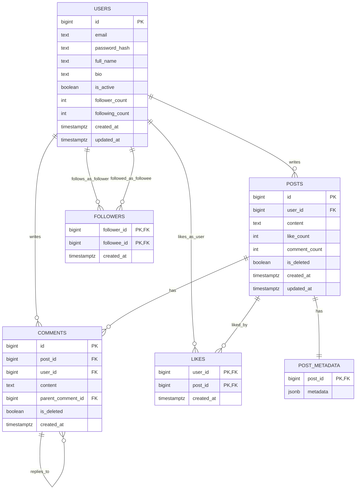

# Database design

PostgreSQL is the system of record for users, posts, comments, followers,
and likes. MongoDB is used only for activity logs; Redis caches rendered
timelines. See [`sql/ddl.sql`](../sql/ddl.sql) for the full DDL (the exact
file the app loads on startup), [`sql/sample_data.sql`](../sql/sample_data.sql)
for a small hand-built dataset to run it against, and
[`postgres_repos.py`](../src/social_media/repositories/postgres_repos.py)
for the query implementations referenced below.

## ER diagram



## Normalization (3NF)

Each table's non-key columns depend on the whole primary key and nothing
else:

- **users** — every column (email, password hash, name, bio...) describes
  that one user and nothing else.
- **posts** — depends only on `posts.id`; `user_id` is a plain FK, not a
  transitive dependency (author details live in `users`, not duplicated here).
- **comments** — same shape as posts, plus a self-referencing
  `parent_comment_id` for threaded replies.
- **followers** / **likes** — pure many-to-many association tables; the
  composite PK *is* the relationship, so there's nothing left to normalize.
- **post_metadata** — deliberately kept **out** of `posts`. Tags/location are
  optional and variable-shape; forcing them into fixed columns on `posts`
  would mean nullable columns for the common case of "no tags." JSONB here
  is a modeling choice for semi-structured data, not a 3NF violation.

**Deliberate denormalization:** `users.follower_count` / `following_count`
(and `posts.like_count` / `comment_count`, already present before this
change) are counts derivable from other tables, cached for O(1) reads
instead of `COUNT(*)` on every profile/post view. They're maintained by the
same transaction that changes the underlying rows (see "Transactional
follow" below) so they can't drift out of sync. This is a standard
performance trade-off, not a normalization mistake — each cached column
still depends only on the row it lives on.

## Indexing strategy

| Index | Table | Purpose |
|---|---|---|
| `users_pkey` | users | PK lookups |
| `users_email_key` | users | unique email, login lookups |
| `idx_posts_user_created` | posts | `(user_id, created_at DESC)` — "my posts" and the feed query's per-author fan-out |
| `idx_posts_feed` | posts | partial `(created_at DESC) WHERE NOT is_deleted` — trending/recency scans without wading through soft-deleted rows |
| `idx_comments_post_created`, `idx_comments_user`, `idx_comments_parent` | comments | thread lookups |
| `followers_pkey` | followers | composite B-tree `(follower_id, followee_id)` — "who do I follow" |
| `idx_followers_followee_follower` | followers | composite B-tree `(followee_id, follower_id)` — "who follows me" (the reverse direction the PK can't serve) |
| `idx_likes_post` | likes | "who liked this post" |
| `idx_post_metadata_gin` | post_metadata | GIN index for JSONB containment queries (e.g. "posts tagged X") |

The two `followers` indexes are the lab's explicit composite-B-tree
requirement — a follow relationship is queried from both ends
(followees-of and followers-of), so it needs both orderings.

## Transactional follow

`FollowerRepository.follow()` ([`postgres_repos.py`](../src/social_media/repositories/postgres_repos.py))
runs three statements inside one `with self._pg.cursor() as cur:` block —
one borrowed connection, one transaction, committed together or rolled back
together:

```sql
INSERT INTO followers (follower_id, followee_id) VALUES (%s, %s);
UPDATE users SET following_count = following_count + 1 WHERE id = %s;
UPDATE users SET follower_count  = follower_count  + 1 WHERE id = %s;
```

If the insert violates the composite PK (already following), `psycopg2`
raises `UniqueViolation`; the connection context manager rolls back
*before* the exception propagates, so the two `UPDATE`s never happen for a
duplicate follow — `follow()` catches it and returns `False` with zero
partial effects. `unfollow()` is symmetric: delete, then decrement both
counters, in the same transaction, only if a row was actually deleted.
Verified in [`tests/test_postgres_repos.py`](../tests/test_postgres_repos.py)
(`TestTransactionalFollow`) against a real Postgres instance — including
that a duplicate follow doesn't double-count and that self-follows are
rejected by the `CHECK (follower_id <> followee_id)` constraint.

## Feed query — CTE + JOIN + `ROW_NUMBER()`

```sql
WITH ranked_feed AS (
    SELECT p.id, p.user_id, p.content, p.like_count, p.comment_count,
           p.created_at, p.updated_at,
           u.full_name AS author_name, u.email AS author_email,
           ROW_NUMBER() OVER (ORDER BY p.created_at DESC, p.id DESC) AS rn
    FROM posts p
    JOIN users u ON u.id = p.user_id
    WHERE p.user_id = ANY(%s) AND NOT p.is_deleted
)
SELECT id, user_id, content, like_count, comment_count, created_at, updated_at,
       author_name, author_email
FROM ranked_feed
WHERE rn > %s AND rn <= %s
ORDER BY rn;
```

The CTE ranks every candidate post (own + followees') by recency; the outer
query slices out one page (`rn > offset AND rn <= offset + limit`) —
`ROW_NUMBER()`-based pagination, stable even with tied timestamps because
`p.id DESC` breaks ties deterministically. The `JOIN` denormalizes the
author's name/email straight into the row instead of a second round trip.

`trending()` is the same JOIN shape, ranked by `like_count*2 + comment_count`
over a recent window instead of by recency — covers the lab's "trending
posts" objective, surfaced in the CLI's Posts → Trending Posts menu.

## `EXPLAIN ANALYZE` — measured on a seeded dataset

Seeded with [`scripts/seed_demo_data.py`](../scripts/seed_demo_data.py):
500 users, 20,000 posts, ~7,900 follow edges. All plans below are real
output from this database, not estimates.

**"My posts" query — `idx_posts_user_created` present:**

```
Limit  (cost=0.29..75.63 rows=20 width=46) (actual time=0.111..0.248 rows=20 loops=1)
  ->  Index Scan using idx_posts_user_created on posts
        Index Cond: (user_id = 398)
        Filter: (NOT is_deleted)
        Buffers: shared hit=25
Execution Time: 0.294 ms
```

**Same query, index dropped:**

```
Limit  (cost=498.28..498.33 rows=20 width=46) (actual time=7.443..7.456 rows=20 loops=1)
  ->  Sort
        Sort Method: top-N heapsort  Memory: 27kB
        ->  Seq Scan on posts
              Filter: ((NOT is_deleted) AND (user_id = 398))
              Rows Removed by Filter: 19952
              Buffers: shared hit=247
Execution Time: 7.543 ms
```

**~26x faster (0.294ms vs 7.543ms), 10x fewer buffer hits (25 vs 250)** with
the index present, on a 20,000-row table. The gap widens with table size —
the seq scan is `O(n)` regardless of how selective the filter is, the index
scan is `O(log n)` to locate the range plus the size of the result.
(Index recreated immediately after this test — it's back in `sql/ddl.sql`'s
steady state.)

**Followers, both directions — composite indexes:**

```
Index Only Scan using followers_pkey on followers      -- follower_id = 398 (who I follow)
  Heap Fetches: 0
Execution Time: 0.063 ms

Index Only Scan using idx_followers_followee_follower   -- followee_id = 398 (who follows me)
  Heap Fetches: 0
Execution Time: 0.013 ms
```

Both are **index-only** scans — the query never touches the heap, because
every column it needs (`follower_id`, `followee_id`) is already in the
index. This is exactly why the table has two composite indexes instead of
one: a single `(follower_id, followee_id)` B-tree serves the first query
but can't serve the second without a full scan.

**Trending query — partial index `idx_posts_feed`:**

```
Bitmap Heap Scan on posts
  Recheck Cond: ((created_at > now() - '168:00:00') AND (NOT is_deleted))
  ->  Bitmap Index Scan on idx_posts_feed
        Index Cond: (created_at > now() - '168:00:00')
Execution Time: 2.998 ms
```

**A finding worth recording, not just the wins:** the multi-followee feed
query (30 followees, ~6% of the 500 users) makes the planner choose a
**sequential scan** over `idx_posts_user_created`, not an index scan — at
that selectivity, scanning 20,000 rows once is cheaper than 30 separate
index probes. Composite indexes help the common single-author case
dramatically; a large `IN`/`ANY` fan-out is a different access pattern with
its own break-even point. Worth knowing rather than assuming "index present"
always means "index used."
